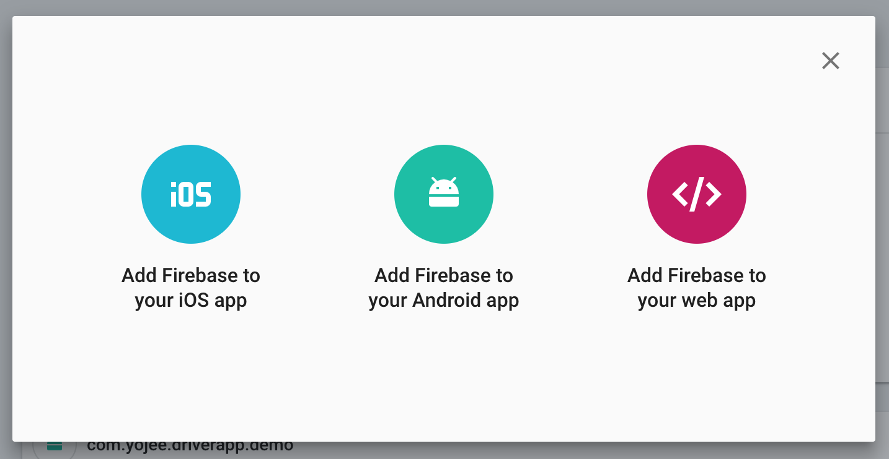
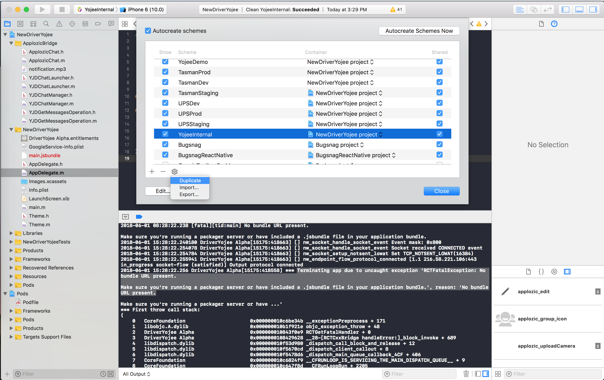

# YOJEE - ADD NEW APP FOR NEW COMPANY

Yojee is a logistic solution company so we need to customize our solution for many logistic companies. In this document, you can understand how to add a new app for the mobile driver app.

## 1: Choose the bundle name:

In this document, we will define the sample bundle name:

- iOS: **com.yojee.sc**
- Android is same: **com.yojee.sc**

## 2: Set up 3rd party environments:
### 2.1 Applozic

- Login into your Applozic
- Add new Module and input full information

- Click Save

### 2.2 Fabrics

- Fabric will be created automatically when you run the app in first time with new bundle identify. But we should only run the app after changed the product name and bundle identify.

### 2.3 FCM

- Login into [https://console.firebase.google.com/u/0/project/sendyojee/overview](https://console.firebase.google.com/u/0/project/sendyojee/overview)
- Add new app by clicking **Add Another App**

- You need to create one app for iOS, one for Android and follow step to step.

### 2.4 Sentry 

- Login into [https://sentry.io/yojee-limited/](https://sentry.io/yojee-limited/)
- Create new Sentry project
- Get DNS client key at [https://sentry.io/settings/yojee-limited/yojee-umbrella/keys/](https://sentry.io/settings/yojee-limited/yojee-umbrella/keys/) (you should choose your project) and we will use the DSN key in next step.

## 3: Configure .env file and theme in Javascript source
### Add new .env file
- Create new .env.{company-name}.{environment} at root of project. If we have multiple environments (dev, demo, staging, production), you can create multiple files.
- You should copy content from old .env files and adjust variables for new company.

### Add new theme
- Define new theme at: *src/theme/theme.js* by copy existing theme and modify.
- Update *THEME* variable in your .env configuration files.

## 4: iOS Configuration
### 4.1 Configure for Main project
- Add new theme by duplicate existing theme

- Add new build configuration by duplicate existing build configuration.

- Configure environment variable

### 4.2 Configure Applozic project
- Add build configuration for Applozic project by duplicate existing build configuration.

### 4.3 Configure scheme for POD project

### 4.4 Configure bundle identify, App Name, App Logo, Splash Image
After you added theme, you can see your scheme name in build settings where we can change bundle identify, app name, app icon, launch image.

- **Bundle Identify**

- **App Name**

- **Launch Image** (you need add launching image into *Images.xcassets*)

- **App Icon** (you need add app icon into *Images.xcassets*)

### 4.5 Configure certificates, provisioning profile for building in development and production
- The latest step, you need go to Apple Developer Portal at: [https://developer.apple.com/](https://developer.apple.com/) to create **Certificate** and **Provisioning Profile** to build
- Set provisioning profile for your new scheme

## 5: Android Configuration
### 5.1 Update android/app/build.gradle
- Find *project.ext.envConfigFiles*, define your scheme name and set the path to your env file.
- Find *android -> productFlavors* to define your build configuration.
- You can add your custom signing config if need. This is optional step.

### 5.2 Add assets for new company
- Add new assets folder at `android/app/src`
